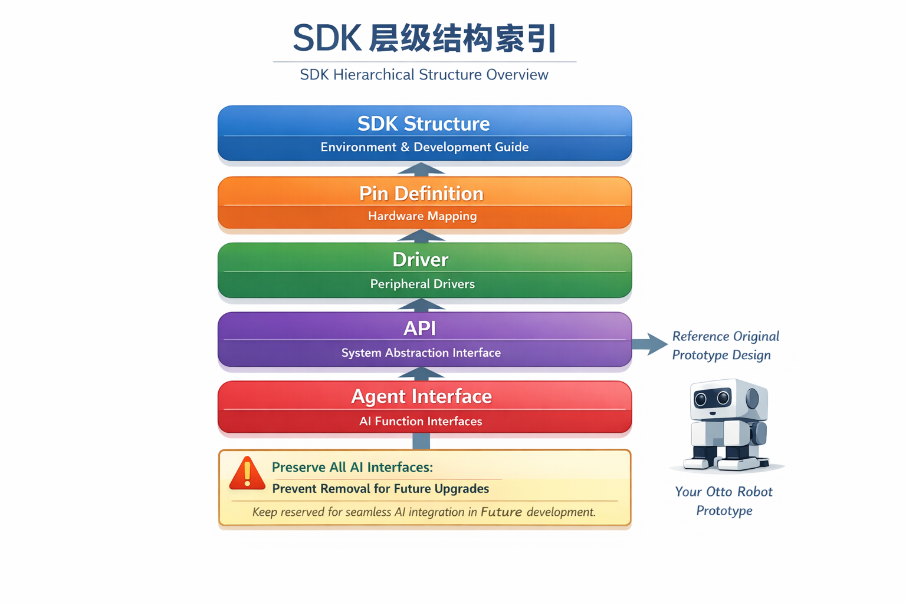

# SDK README（面向 Agent 的表格化索引）

## 文档说明

本 README 为 AI Agent 开发提供统一的开发流程、接口规范和使用逻辑，确保 Agent 在编码过程中严格遵循 SDK 架构，避免重复开发或自行设计功能偏离原型。

> **核心目标**：
> - 当前阶段 **不使用 AI 功能**，但保留 `Agent_Interface` 用于未来升级和拓展 AI 功能。
> - Agent 在开发过程中必须 **保留所有接口**，避免阉割或删除，以支持后续无痛升级。
> - 开发应基于 `your_otto_robot.md` 原型进行功能增删改动，避免自行随意编码偏离原型或 SDK 规范。

### 开发原则

1. 基于原型文档进行功能增删改动，遵循原型逻辑。
2. 避免重复开发已有功能模块，调用已有接口即可。
3. 遵循编码风格与项目规范，确保可维护性。
4. 按层级索引查找文档，实现开发逻辑清晰、规范。
5. 保留 `Agent_Interface`，确保未来升级 AI 功能无痛集成。

---

## 可视化开发索引图

---

## SDK 层级表格索引

| 层级 | 文档/模块 | 说明 | 作用与使用方式 |
|------|-----------|------|----------------|
| SDK_Structure | coding-style-guide.md | 编码风格指南 | 指导 Agent 编码规范，保证一致性 |
| SDK_Structure | equipment-authorization.md | 设备授权说明 | 确认开发环境许可，确保合法访问硬件 |
| SDK_Structure | compilation-guide.md | 编译指南 | 指导 Agent 调用构建工具生成可执行程序 |
| SDK_Structure | firmware-burning.md | 固件烧录指南 | 指导烧录流程，保证固件正确加载 |
| SDK_Structure | demo-generic-examples.md | 通用示例演示 | 提供参考示例，避免重复造轮子 |
| SDK_Structure | project-compilation.md | 项目编译说明 | 项目构建与依赖说明 |
| SDK_Structure | device-debug.md | 设备调试指南 | 确保 Agent 能独立完成调试 |
| SDK_Structure | project-walkthrough.md | 项目讲解 | 帮助 Agent 理解整体流程 |
| SDK_Structure | device-network-configuration.md | 设备网络配置 | 确保网络相关功能可用 |
| SDK_Structure | tools-tyutool.md | TYU 工具使用指南 | Agent 可调用工具进行辅助操作 |
| SDK_Structure | enviroment-setup.md | 环境搭建指南 | 快速准备开发环境 |
| SDK_Structure | tos-guide.md | TOS 使用指南 | 系统操作参考 |

| 层级 | 文档/模块 | 说明 | 作用与使用方式 |
|------|-----------|------|----------------|
| Pin_Definition | t5ai-peripheral-mapping.md | T5AI 外设映射说明 | 指导 Agent 正确生成硬件连接方案 |

| 层级 | 文档/模块 | 说明 | 作用与使用方式 |
|------|-----------|------|----------------|
| Driver | audio.md | 音频驱动 | 提供接口调用音频功能 |
| Driver | button.md | 按键驱动 | 提供接口读取按键状态 |
| Driver | display.md | 显示驱动 | 提供接口操作显示屏 |
| Driver | support_peripheral_list.md | 支持外设列表 | 参考支持的扩展外设接口 |

| 层级 | 文档/模块 | 说明 | 作用与使用方式 |
|------|-----------|------|----------------|
| API | tkl_adc.md | ADC 接口 | 采集模拟信号 |
| API | tkl_flash.md | Flash 接口 | 读写存储器 |
| API | tkl_i2s.md | I2S 接口 | 音频数据传输 |
| API | tkl_network.md | 网络接口 | 网络通信操作 |
| API | tkl_pinmux.md | 引脚复用接口 | 配置引脚复用功能 |
| API | tkl_rtc.md | RTC 接口 | 实时时钟操作 |
| API | tkl_system.md | 系统接口 | 系统功能操作 |
| API | tkl_uart.md | UART 接口 | 串口通信操作 |
| API | tkl_wifi.md | WiFi 接口 | 无线网络操作 |
| API | tkl_bluetooth.md | 蓝牙接口 | 蓝牙通信操作 |
| API | tkl_gpio.md | GPIO 接口 | 通用输入输出操作 |
| API | tkl_lwip.md | LWIP 接口 | 网络协议栈调用 |
| API | tkl_ota.md | OTA 接口 | 固件远程更新 |
| API | tkl_pwm.md | PWM 接口 | PWM 输出控制 |
| API | tkl_semaphore.md | 信号量接口 | 线程同步 |
| API | tkl_thread.md | 线程接口 | 创建/管理线程 |
| API | tkl_wakeup.md | 唤醒接口 | 系统唤醒管理 |
| API | tkl_wired.md | 有线网络接口 | 有线网络通信 |
| API | tkl_dac.md | DAC 接口 | 模拟输出信号 |
| API | tkl_i2c.md | I2C 接口 | I2C 总线通信 |
| API | tkl_mutex.md | 互斥锁接口 | 线程资源互斥 |
| API | tkl_output.md | 输出接口 | 控制外设输出 |
| API | tkl_register.md | 寄存器接口 | 访问硬件寄存器 |
| API | tkl_spi.md | SPI 接口 | SPI 总线通信 |
| API | tkl_timer.md | 定时器接口 | 定时控制功能 |
| API | tkl_watchdog.md | 看门狗接口 | 系统异常保护 |

| 层级 | 文档/模块 | 说明 | 作用与使用方式 |
|------|-----------|------|----------------|
| Agent_Interface | ai-agent.md | Agent 接口说明 | 保留接口，当前不使用，防止阉割，确保未来 AI 功能无痛升级 |
| Agent_Interface | ai-audio-player.md | 音频播放器模块 | 保留接口 |
| Agent_Interface | ai-main.md | 主程序说明 | 保留接口 |
| Agent_Interface | ai-mode-hold.md | 保持模式 | 保留接口 |
| Agent_Interface | ai-mode-wakeup.md | 唤醒模式 | 保留接口 |
| Agent_Interface | ai-video-input.md | 视频输入模块 | 保留接口 |
| Agent_Interface | ai-audio-input.md | 音频输入模块 | 保留接口 |
| Agent_Interface | ai-components.md | 组件说明 | 保留接口 |
| Agent_Interface | ai-mode-free.md | 自由模式 | 保留接口 |
| Agent_Interface | ai-mode-oneshot.md | 单次模式 | 保留接口 |
| Agent_Interface | ai-skill.md | 技能接口 | 保留接口 |

| 层级 | 文档/模块 | 说明 | 作用与使用方式 |
|------|-----------|------|----------------|
| 其他文档 | your_otto_robot.md | Otto 机器人说明文档 | 作为原型参考，所有开发基于该文档 |

